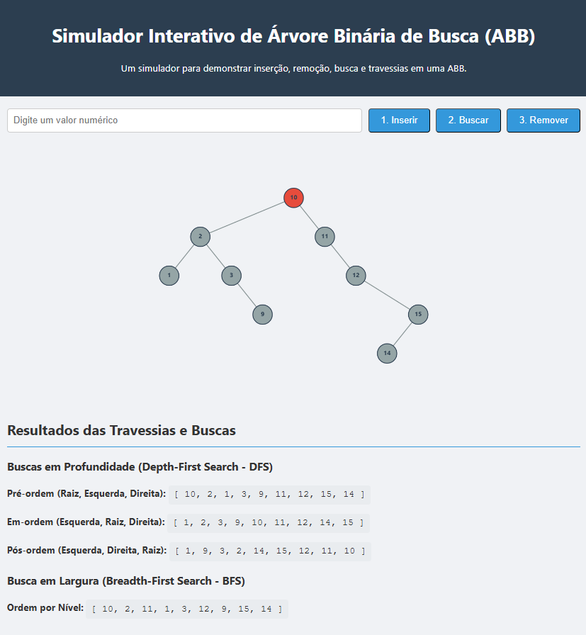

# Simulador Interativo de Árvore Binária de Busca (ABB)

## 📖 Visão Geral do Projeto

Este projeto é um simulador interativo e visual para a estrutura de dados **Árvore Binária de Busca (ABB)**. Desenvolvido com tecnologias web modernas, o simulador oferece uma interface limpa e **totalmente responsiva**, permitindo a manipulação e visualização da árvore em qualquer dispositivo, de desktops a celulares.

## ✨ Funcionalidades Principais

### Operações da ABB
- [x] **Inserção de Elementos**: Adiciona nós à árvore de forma recursiva, mantendo as propriedades da ABB.
- [x] **Remoção de Elementos**: Remove nós tratando corretamente os três casos (folha, um filho, dois filhos) de forma recursiva.
- [x] **Busca de Elementos**: Verifica a existência de um nó na árvore com feedback visual ao usuário.

### Algoritmos de Percurso
- [x] **Busca em Profundidade (DFS)**: Exibição dos resultados das travessias:
  - Pré-ordem (Pre-order)
  - Em-ordem (In-order)
  - Pós-ordem (Post-order)
- [x] **Busca em Largura (BFS)**: Exibição do percurso por níveis.

## 📸 Screenshot

## 🛠️ Tecnologias Utilizadas

* **HTML5**: Para a estrutura semântica do conteúdo.
* **CSS3**: Para estilização, layout responsivo com Flexbox e Media Queries.
* **JavaScript (ES6+)**: Para toda a lógica da estrutura de dados, manipulação do DOM e a renderização dinâmica no Canvas API.

## 📂 Estrutura do Código

* **`index.html`**: Estrutura principal da página.
* **`style.css`**: Estilização visual e responsividade.
* **`js/`**: Pasta contendo toda a lógica da aplicação.
    * **`main.js`**: Orquestra a aplicação, manipulando eventos e conectando os módulos.
    * **`Arvore.js`**: Contém a definição da estrutura de dados da ABB (classes `No` e `ArvoreBinariaBusca`).
    * **`AlgoritmosBusca.js`**: Isola a lógica de busca e dos diferentes tipos de percurso.
    * **`Desenhista.js`**: Responsável exclusivamente por toda a lógica de desenho da árvore no canvas.

## 🚀 Como Executar

Existem duas maneiras simples de rodar este projeto localmente. A primeira é a mais recomendada.

### Método 1: Usando um Servidor Local (Recomendado)

1.  Se você usa o **Visual Studio Code**, instale a extensão [Live Server](https://marketplace.visualstudio.com/items?itemName=ritwickdey.LiveServer).
2.  Abra a pasta do projeto no VS Code.
3.  Clique com o botão direito no arquivo `index.html`.
4.  Selecione a opção **"Open with Live Server"**.
5.  O projeto abrirá automaticamente no seu navegador padrão.

### Método 2: Abrindo o Arquivo Diretamente

1.  Clone ou baixe este repositório.
2.  Navegue até a pasta do projeto.
3.  Abra o arquivo `index.html` diretamente no seu navegador.

---
